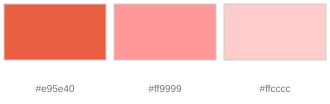
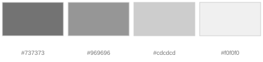

# Colours

The BINDER appearance rests on a triad of **black, white and BINDER Red**. This triad is
the core of the corporate design and a primary design element in its own right. The
shades support it and must never dilute its contrast.

Machine-readable versions live in [tokens/](tokens/): [`colors.json`](tokens/colors.json),
[`colors.css`](tokens/colors.css) and [`colors.scss`](tokens/colors.scss).

**Hex values apply to screen, CMYK values apply to print.**

## Primary colours

| Colour | Hex | CMYK | Print references |
|---|---|---|---|
| **BINDER Red** | `#e60000` | 0/100/100/0 | HKS 14, Pantone 485, RAL 3020 Traffic Red |
| **Black** | `#000000` | 0/0/0/100 | HKS 88, Pantone 426, RAL 9005 Jet Black |
| **White** | `#ffffff` | 0/0/0/0 | RAL 9003 Signal White |
| **Red Dark** | `#990000` | 24/100/100/27 | HKS 16, RAL 3003 Ruby Red |

**BINDER Red** is the highlight colour: emphasis in type, graphic elements, icons,
and design elements that need to stand out.

**Black** is the primary text colour and the base for graphics and icons. Avoid large,
full-coverage black areas.

**White** is used generously and over large areas: for structure, as background colour
for white space, and as the design colour in negative applications. White is what gives
the triad its contrast.

**Red Dark** sets restrained accents alongside BINDER Red — in graphics, icons, and as
the mouseover state of a red button on the web.

## Shades

Available in reduced use for graphic elements. Take care that they do not weaken the
high-contrast impression of the black/white/red triad.

### Red

| Hex | CMYK | RGB |
|---|---|---|
| `#e95e40` | 0/75/75/0 | 233/94/64 |
| `#ff9999` | 0/40/40/0 | 255/153/153 |
| `#ffcccc` | 0/20/20/0 | 255/204/204 |

### Black

| Hex | CMYK | RGB |
|---|---|---|
| `#737373` | 0/0/0/65 | 115/115/115 |
| `#969696` | 0/0/0/45 | 150/150/150 |
| `#cdcdcd` | 0/0/0/25 | 205/205/205 |
| `#f0f0f0` | 0/0/0/10 | 240/240/240 |

## BINDER Green

`#97bf29` · CMYK 75/0/100/0

For **sustainability and eco topics** (BINDER goes green).

## Chart colours

| Key | Hex | CMYK | RGB |
|---|---|---|---|
| A | `#fde800` | 5/0/100/0 | 253/232/0 |
| B | `#fabb00` | 0/30/100/0 | 250/187/0 |
| C | `#e95d0f` | 0/75/100/0 | 233/93/15 |
| D | `#e60000` | 0/100/100/0 | 230/0/0 |
| E | `#c3077f` | 22/97/0/0 | 195/7/127 |
| F | `#622181` | 75/100/0/0 | 98/33/129 |
| G | `#38378b` | 90/90/0/0 | 56/55/139 |
| H | `#006fb4` | 90/50/0/0 | 0/111/180 |
| I | `#0099bf` | 80/20/15/0 | 0/153/191 |
| J | `#26965e` | 80/15/75/0 | 38/150/94 |
| K | `#97bf29` | 50/0/95/0 | 151/191/41 |
| L | `#bdcd00` | 35/0/100/0 | 189/205/0 |

### Which colours for how many values

Do not pick freely — take the prescribed sequence for the number of values in your
chart. This keeps charts recognisable across all BINDER media.

| Values | Sequence |
|---|---|
| 1 | A |
| 2 | A · D |
| 3 | A · D · H |
| 4 | A · D · H · K |
| 5 | A · D · G · J · L |
| 6 | A · C · E · G · I · K |
| 7 | A · C · E · G · I · J · L |
| 8 | A · B · D · F · H · I · K · L |
| 9 | A · B · D · E · G · H · I · K · L |
| 10 | A · B · D · E · G · H · I · J · K · L |
| 11 | A · B · C · D · E · G · H · I · J · K · L |

Text inside charts follows the same rule as everywhere else: never below 6 pt.
See [typography.md](typography.md).
