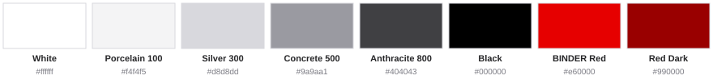
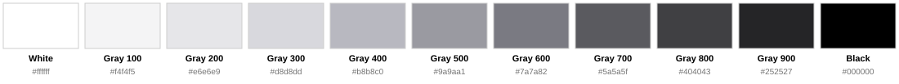
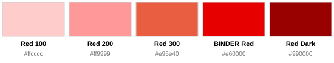
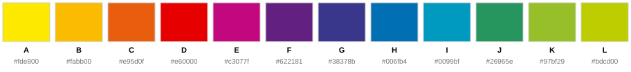

# Colors

The BINDER appearance rests on a triad of **black, white and BINDER Red**. This triad is
the core of the corporate design and a primary design element in its own right.
Everything else supports it and must never dilute its contrast.

Machine-readable versions live in [tokens/](tokens/): [`colors.json`](tokens/colors.json),
[`colors.css`](tokens/colors.css) and [`colors.scss`](tokens/colors.scss).

**Hex values apply to screen, CMYK values apply to print.** The grays carry a slight blue
cast on screen but print as pure K with no CMY component: converted exactly, the cast
comes to a few percent of cyan and magenta, which offset printing cannot reproduce reliably
printing. Use hex on screen and CMYK on paper.

## Primary colors

| Color | Hex | CMYK | Print references | Use |
|---|---|---|---|---|
| **White** | `#ffffff` | 0/0/0/0 | RAL 9003 Signal White | Structure, backgrounds, white space, negative applications |
| **Gray 100** | `#f4f4f5` | 0/0/0/5 | — | Sections, cards, subtle backgrounds |
| **Gray 300** | `#d8d8dd` | 0/0/0/20 | — | Borders, secondary elements |
| **Gray 500** | `#9a9aa1` | 0/0/0/45 | — | Muted text, dividers, secondary UI elements |
| **Gray 800** | `#404043` | 0/0/0/80 | — | Text on screen and important UI elements — the dark tone that is not black |
| **Black** | `#000000` | 0/0/0/100 | HKS 88, Pantone 426, RAL 9005 Jet Black | Text in print, base for graphics and icons — avoid large full-coverage areas |
| **BINDER Red** | `#e60000` | 0/100/100/0 | HKS 14, Pantone 485, RAL 3020 Traffic Red | Highlight color, graphic elements, icons, emphasis |
| **Red Dark** | `#990000` | 24/100/100/27 | HKS 16, RAL 3003 Ruby Red | Accent alongside BINDER Red, contrast, mouseover state of red buttons |

## The gray scale

The scale runs 100 (lightest) to 900 (darkest), the same direction as CSS
`font-weight`.

White and black carry no number. They sit outside the ramp, exactly as `$white` and
`$black` do in Bootstrap and Tailwind: a `0` would read as `#000`, which is black.

| Name | Scale | Hex | CMYK | L\* | Step | CMYK, screen match (not for print) |
|---|---|---|---|---|---|---|
| **White** | — | `#ffffff` | 0/0/0/0 | 100.0 | — | 0/0/0/0 |
| **Porcelain** | 100 | `#f4f4f5` | 0/0/0/5 | 96.2 | 3.8 | 1/1/0/5 |
| **Pearl** | 200 | `#e6e6e9` | 0/0/0/10 | 91.4 | 4.8 | 3/2/0/11 |
| **Silver** | 300 | `#d8d8dd` | 0/0/0/20 | 86.5 | 4.9 | 5/4/0/16 |
| **Ash** | 400 | `#b8b8c0` | 0/0/0/30 | 75.0 | 11.5 | 8/8/0/30 |
| **Concrete** | 500 | `#9a9aa1` | 0/0/0/45 | 63.8 | 11.2 | 9/8/0/45 |
| **Slate** | 600 | `#7a7a82` | 0/0/0/60 | 51.5 | 12.3 | 13/12/0/58 |
| **Basalt** | 700 | `#5a5a5f` | 0/0/0/70 | 38.4 | 13.1 | 12/10/0/73 |
| **Anthracite** | 800 | `#404043` | 0/0/0/80 | 27.2 | 11.2 | 11/9/0/84 |
| **Graphite** | 900 | `#252527` | 0/0/0/90 | 14.8 | 12.4 | 12/9/0/93 |
| **Black** | — | `#000000` | 0/0/0/100 | 0.0 | 14.8 | 0/0/0/100 |

L\* is perceived lightness, 0 black to 100 white. Step is the distance to the
previous gray.

The CMYK values are pure K, chosen with the Coated FOGRA39 press profile so that the
printed gray has the same lightness as the screen value wherever black ink can reach it.
From Slate 600 down it cannot: 100 % K on coated stock is about L\* 17, so the dark grays
print in even steps that are lighter than on screen but stay distinguishable from black.
Do not compensate with rich black. Print PDFs are mostly viewed on screen; a PDF viewer
simulates these values through the document profile, so they look right there too.

The screen-match column is a maximum-K separation of the screen value, computed with
ArgyllCMS against Coated FOGRA39 with black point compensation: black carries the tone, a
few percent of cyan and magenta carry the cast. Only for a CMYK document that is viewed on screen and must match
the web colors, never for print.

The ramp is denser at the light end on purpose: pale surface tones get used over
large areas, where small differences matter. The dark half steps more widely, because
the eye separates dark tones less well anyway.

## The red scale

| Color | Hex | CMYK |
|---|---|---|
| Red 100 | `#ffcccc` | 0/20/20/0 |
| Red 200 | `#ff9999` | 0/40/40/0 |
| Red 300 | `#e95e40` | 0/75/75/0 |
| BINDER Red | `#e60000` | 0/100/100/0 |
| Red Dark | `#990000` | 24/100/100/27 |

BINDER Red and Red Dark carry no number - they are brand colors, not ramp steps.

**Red Dark** is the accent alongside BINDER Red: a calm, high-grade color for
restrained emphasis in graphics and icons, and the mouseover state of a red button.

## BINDER Green

`#97bf29` - CMYK 50/0/95/0

For **sustainability and eco topics** (BINDER goes green). Not a general-purpose
accent - using it elsewhere weakens the black/white/red triad.

## Chart colors

| Key | Hex | CMYK |
|---|---|---|
| A | `#fde800` | 5/0/100/0 |
| B | `#fabb00` | 0/30/100/0 |
| C | `#e95d0f` | 0/75/100/0 |
| D | `#e60000` | 0/100/100/0 |
| E | `#c3077f` | 22/97/0/0 |
| F | `#622181` | 75/100/0/0 |
| G | `#38378b` | 90/90/0/0 |
| H | `#006fb4` | 90/50/0/0 |
| I | `#0099bf` | 80/20/15/0 |
| J | `#26965e` | 80/15/75/0 |
| K | `#97bf29` | 50/0/95/0 |
| L | `#bdcd00` | 35/0/100/0 |

### Which colors for how many values

Do not pick freely - take the prescribed sequence for the number of values in your
chart. This keeps charts recognizable across all BINDER media.

| Values | Sequence |
|---|---|
| 1 | A |
| 2 | A - D |
| 3 | A - D - H |
| 4 | A - D - H - K |
| 5 | A - D - G - J - L |
| 6 | A - C - E - G - I - K |
| 7 | A - C - E - G - I - J - L |
| 8 | A - B - D - F - H - I - K - L |
| 9 | A - B - D - E - G - H - I - K - L |
| 10 | A - B - D - E - G - H - I - J - K - L |
| 11 | A - B - C - D - E - G - H - I - J - K - L |

Text inside charts follows the same rule as everywhere else: never below 6 pt.
See [typography.md](typography.md).
